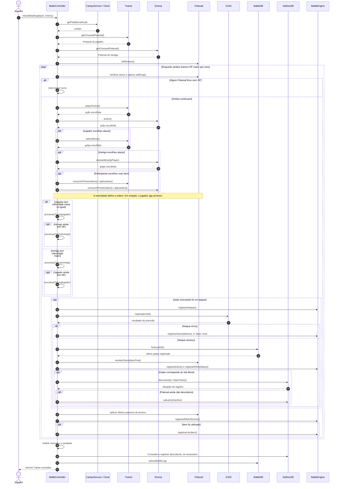

# Diagrama de Sequência UML — Turno de Batalha 

```mermaid
sequenceDiagram
    autonumber
    actor Jogador
    participant BC as BattleController
    participant Campo as CampoService / Clock
    participant Player as Trainer
    participant Enemy as Enemy
    participant P as Pokesal
    participant D100 as D100
    participant DB as BattleDB
    participant SalDex as SalDexDB
    participant Log as BattleEngine

    Jogador->>BC: iniciarBatalha(player, enemy)
    BC->>Campo: getField(horaAtual)
    Campo-->>BC: campo
    BC->>Player: getChoosedPokesal()
    Player-->>BC: Pokesal do jogador
    BC->>Enemy: getChoosedPokesal()
    Enemy-->>BC: Pokesal do inimigo
    BC->>P: fullRestore()

    loop Enquanto ambos tiverem HP maior que zero
        BC->>P: Verificar stress e aplicar selfDmg()
        alt Algum Pokesal ficou sem HP
            BC->>BC: Interromper turno
        else Ambos continuam
            BC->>Player: playerAction()
            Player-->>BC: ação escolhida
            BC->>Enemy: action()
            Enemy-->>BC: ação escolhida

            opt Jogador escolheu atacar
                BC->>Player: selectMove()
                Player-->>BC: golpe escolhido
            end

            opt Inimigo escolheu atacar
                BC->>Enemy: chooseMove(pPlayer)
                Enemy-->>BC: golpe escolhido
            end

            opt Participante escolheu usar item
                BC->>Player: consumirPrimeiroItem() / aplicarItem()
                BC->>Enemy: consumirPrimeiroItem() / aplicarItem()
            end

            Note over BC,P: A velocidade define a ordem. Em empate, o jogador age primeiro.

            alt Jogador tem velocidade maior ou igual
                BC->>BC: processarTurno(jogador)
                opt Inimigo ainda tem HP
                    BC->>BC: processarTurno(inimigo)
                end
            else Inimigo tem velocidade maior
                BC->>BC: processarTurno(inimigo)
                opt Jogador ainda tem HP
                    BC->>BC: processarTurno(jogador)
                end
            end

            opt Ação executada foi um ataque
                BC->>Log: registrarAtaque()
                BC->>D100: rolarDado100()
                D100-->>BC: resultado da precisão

                alt Ataque errou
                    BC->>Log: registrarDano(defensor, 0, false, true)
                else Ataque acertou
                    BC->>DB: findLastHit()
                    DB-->>BC: último golpe registrado
                    BC->>P: receberDano(danoFinal)
                    BC->>Log: registrarDano() e registrarEfeitoStatus()

                    opt Golpe corresponde ao Sal-Move
                        BC->>SalDex: discovered() / listarTodos()
                        SalDex-->>BC: situação do registro
                        opt Pokesal ainda não descoberto
                            BC->>SalDex: salvar(nomeAlvo)
                        end
                    end
                end
            end

            BC->>P: Aplicar efeitos passivos do terreno
            BC->>Log: registrarEfeitoTerreno()

            opt Item foi utilizado
                BC->>Log: registrarUsoItem()
            end
        end
    end

    BC->>BC: Definir vencedor e perdedor
    BC->>SalDex: Consultar e registrar descoberta, se necessário
    BC->>DB: salvar(BattleLog)
    BC-->>Jogador: retorna Trainer vencedor
```
