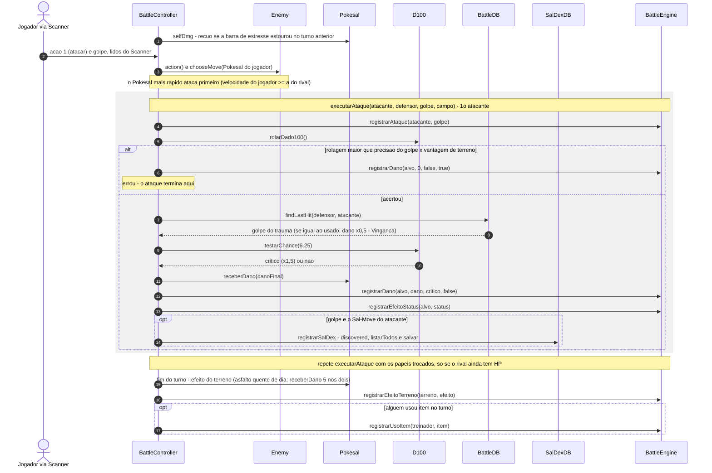

```mermaid
sequenceDiagram
    autonumber
    actor J as Jogador via Scanner
    participant BC as BattleController
    participant EN as Enemy
    participant PK as Pokesal
    participant D as D100
    participant DB as BattleDB
    participant SD as SalDexDB
    participant LG as BattleEngine
 
    BC->>PK: selfDmg - recuo se a barra de estresse estourou no turno anterior
    J->>BC: acao 1 (atacar) e golpe, lidos do Scanner
    BC->>EN: action() e chooseMove(Pokesal do jogador)
    Note over BC,EN: o Pokesal mais rapido ataca primeiro (velocidade do jogador >= a do rival)
 
    rect rgb(240, 240, 240)
        Note over BC,LG: executarAtaque(atacante, defensor, golpe, campo) - 1o atacante
        BC->>LG: registrarAtaque(atacante, golpe)
        BC->>D: rolarDado100()
        alt rolagem maior que precisao do golpe x vantagem de terreno
            BC->>LG: registrarDano(alvo, 0, false, true)
            Note over BC: errou - o ataque termina aqui
        else acertou
            BC->>DB: findLastHit(defensor, atacante)
            DB-->>BC: golpe do trauma (se igual ao usado, dano x0,5 - Vinganca)
            BC->>D: testarChance(6.25)
            D-->>BC: critico (x1,5) ou nao
            BC->>PK: receberDano(danoFinal)
            BC->>LG: registrarDano(alvo, dano, critico, false)
            BC->>LG: registrarEfeitoStatus(alvo, status)
            opt golpe e o Sal-Move do atacante
                BC->>SD: registrarSalDex - discovered, listarTodos e salvar
            end
        end
    end
 
    Note over BC,LG: repete executarAtaque com os papeis trocados, so se o rival ainda tem HP
 
    BC->>PK: fim do turno - efeito do terreno (asfalto quente de dia: receberDano 5 nos dois)
    BC->>LG: registrarEfeitoTerreno(terreno, efeito)
    opt alguem usou item no turno
        BC->>LG: registrarUsoItem(treinador, item)
    end
```
