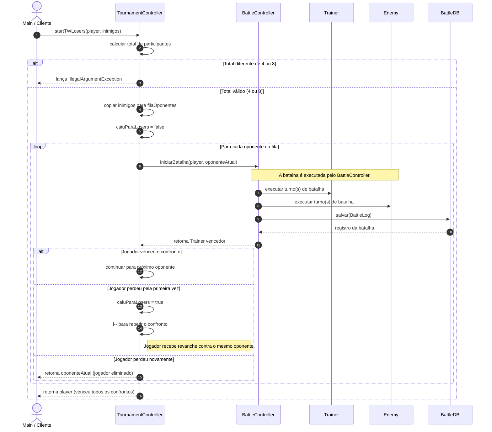

# Diagrama de Sequência UML — Resultado do Torneio 

```mermaid
sequenceDiagram
    autonumber
    actor Cliente as Main / Cliente
    participant TC as TournamentController
    participant BC as BattleController
    participant Player as Trainer
    participant Enemy as Enemy
    participant DB as BattleDB

    Cliente->>TC: startTWLosers(player, inimigos)
    TC->>TC: calcular total de participantes

    alt Total diferente de 4 ou 8
        TC-->>Cliente: lança IllegalArgumentException
    else Total válido (4 ou 8)
        TC->>TC: copiar inimigos para filaOponentes
        TC->>TC: caiuParaLosers = false

        loop Para cada oponente da fila
            TC->>BC: iniciarBatalha(player, oponenteAtual)

            Note over BC,Enemy: A batalha é executada pelo BattleController.

            BC->>Player: executar turno(s) de batalha
            BC->>Enemy: executar turno(s) de batalha
            BC->>DB: salvar(BattleLog)
            DB-->>BC: registro da batalha
            BC-->>TC: retorna Trainer vencedor

            alt Jogador venceu o confronto
                TC->>TC: continuar para próximo oponente

            else Jogador perdeu pela primeira vez
                TC->>TC: caiuParaLosers = true
                TC->>TC: i-- para repetir o confronto
                Note right of TC: Jogador recebe revanche contra o mesmo oponente.

            else Jogador perdeu novamente
                TC-->>Cliente: retorna oponenteAtual (jogador eliminado)
            end
        end

        TC-->>Cliente: retorna player (venceu todos os confrontos)
    end
```
